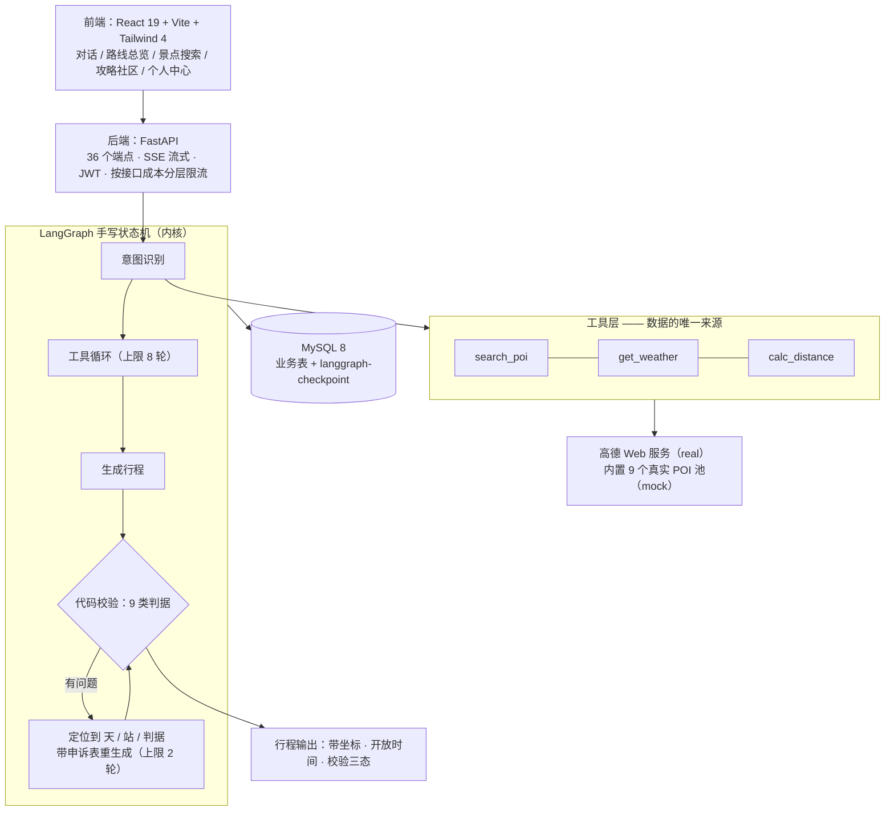

# 智能旅游规划系统

> 给一句话需求（或一段现成行程），产出一份**带坐标、开放时间、步行强度**的行程，
> 并自己检查哪里不对、改到能过为止。

全栈 AI 应用：**LangGraph 手写状态机 + FastAPI + React**。
agent 引擎是唯一主线，CRUD 只做"能接回主线"的部分。

---

## 一、它和"让大模型写一份行程"的区别

| 常见做法 | 这里的做法 |
|---|---|
| 模型凭记忆吐一份行程 | 模型**只能通过工具拿数据**（搜景点 / 查天气 / 测距）—— 景点真实存在、距离真实算过 |
| 行程对不对没人知道 | **9 类判据由代码判定**（5 硬 + 4 软），三态 `pass` / `fail` / `unknown` |
| 出错就整份重来 | **定位到"哪一天、哪一站、哪条判据"** → 带申诉表重生成，最多 2 轮 |
| 拿不到数据就编 | 拿不到标 `unknown` —— **不编，也不判错** |

**一句话说清定位**：这不是"会调大模型的增删改查"，是**一个有校验闭环的生成系统**。

---

## 二、两入口一内核

| 入口 | 输入 | 流程 |
|---|---|---|
| **冷启动** | 一句话需求（"后天去成都 2 天，带爸妈，节奏慢一点"） | 意图识别 → 生成 → 校验 → 定位问题 → 修正 → 再校验 |
| **热启动** | 粘贴一段现成行程 | 直接校验 → 定位问题 |

**内核只有一个**：`验证 → 定位问题 → 修正 → 再验证`。
两条入口共用同一套校验器 —— 这也是"出行程"之外，这个项目真正难的地方。

---

## 三、架构



**两个可切换的数据源**：`AMAP_PROVIDER=mock|real`。
mock 读内置的 9 个真实 POI（零配额、结果可复现，用于测试与并行开发），
real 走真·高德 Web 服务。**两者接口与响应结构完全一致，前端无感知。**

---

## 四、技术栈

| 层 | 选型 |
|---|---|
| Agent | **LangGraph 1.2 手写 StateGraph**（不用 `create_agent` 封装）、LangChain Core |
| 模型 | DeepSeek / 通义千问（任何 OpenAI 兼容接口；按模型名自动路由 provider） |
| 后端 | FastAPI 0.141 + Pydantic 2.13 + uvicorn |
| 持久化 | MySQL 8 + `langgraph-checkpoint-mysql`（会话状态可恢复） |
| 鉴权 | JWT（PyJWT）+ bcrypt |
| 数据源 | 高德 Web 服务（自己写 3 个工具，不走 MCP） |
| 流式 | SSE（`astream_events` → `StreamingResponse`，每帧带 `id:`） |
| 前端 | React 19 + Vite + TypeScript + Tailwind 4 + Swiper |

---

## 五、跑起来

**前置**：Docker、Python 3.13、Node 22。

```bash
# 1) 配置：复制模板填值（高德 Key 可先不填 —— 用 mock 模式跑）
cp .env.example .env

# 2) 起数据库
docker compose up -d

# 3) 后端
python -m venv .venv
./.venv/Scripts/pip install -r requirements.txt          # Windows
cd backend && ../.venv/Scripts/python -m uvicorn app.api.main:app --reload

# 4) 前端（另开一个终端）
cd frontend && npm install && npm run dev                 # http://localhost:5173
```

两个 Key 说明：

- **`AMAP_PROVIDER=mock`（默认）不需要任何 Key** —— 开箱就能跑通全流程
- 要用真数据：`AMAP_PROVIDER=real` + 填 `AMAP_WEBSERVICE_KEY`（服务平台选「Web 服务」）
- 前端地图另需 `AMAP_JS_KEY` + `AMAP_JS_SECURITY_CODE`（服务平台选「Web端(JS API)」）

**自检**：后端起来后开 `http://127.0.0.1:8000/verify` —— 一个零构建的冒烟页，把主要读路径和错误形状打一遍。

---

## 六、项目结构

```
backend/app/
  graph/          agent 内核：意图 / 工具循环 / 生成 / 校验 / 修正 / 粘贴路径
  tools/          3 个工具（search_poi / get_weather / calc_distance）
  providers/      数据源：amap（真）/ mock（9 点池）—— 同签名可切换
  api/routes/     36 个端点，按资源分文件
  schemas.py      ★ 数据契约唯一事实源（69 个导出名）
  store/          MySQL 仓储
  services/       鉴权 / 限流 / 上传等
backend/tests/    506 个用例
eval/             评测集（12 条 case + runner + 报告）
docs/api.md       接口契约（37 个端点 / 9 种 SSE 事件 / 错误码表）
docs/types.ts     62 个 TS 类型 —— 由 schemas.py 自动生成，前端不手抄
DECISIONS.md      ★ 64 条决策记录：为什么这么定 / 没选什么 / 代价 / 重审触发
方案.md            做什么         技术方案.md  怎么实现        界面设计.md  长什么样
```

---

## 七、几个工程点

放在这里是因为它们**有代价、有取舍**，不是"用了什么库"这种描述。完整版在 `DECISIONS.md`。

- **数据契约唯一事实源**——`schemas.py` 是唯一的类型定义处，`docs/types.ts` 由脚本自动生成。
  改了契约必须重跑代码生成 + 过 `tsc --strict`。手抄类型两天后必然不一致，**而且不一致不报错**（只是某字段是 `undefined`）。
- **工具的"零幻觉"设计**——模型不能凭记忆说景点在哪儿，坐标/开放时间/距离全部来自工具返回；
  拿不到就标 `unknown`，**既不编也不判错**。
- **判据假阳性比假阴性贵**——把一份正常行程误判成错误，会触发无意义的重生成（实测踩过：距离模型用错常量，白打回两轮）。
  所以每条阈值判据都配"**界内绿 + 超一点红**"两个测试。
- **越权的结构性防线**——不靠"记得写 `WHERE user_id`"（那是约定不是结构，违反不报错），
  而是签名级约束 + 三个扫描断言（写错就测试红）。
- **只重试天然幂等的操作**——`GET` / 搜索 / 天气 / 距离 / LLM 可以退避重试；
  改状态的操作靠唯一索引兜底，**绝不重试**。
- **限流按接口成本分层**——最贵的对话接口 10 次/小时，搜索 120 次/分钟。
- **三态校验而不是布尔**——`unknown` 是独立状态：数据没拿到时如实标注，不当通过也不打回。

---

## 八、评测

`eval/` 下 12 条 case，覆盖 3 类判据的**边界对**（界内绿 ↔ 超一点红）。

定位是 **regression set（回归防线），不是 benchmark** —— 它的用处是回答"改 prompt / 换模型之后，
系统是变好还是变差"，不是"这个 agent 有多强"。

```bash
./.venv/Scripts/python.exe eval/run_eval.py --label my-run        # 全量
./.venv/Scripts/python.exe eval/run_eval.py --cases "*green*.json" # 只跑部分
```

两条刻意的设计取舍：

- **答案由人给，不由 AI 给** —— 人出题（含埋点与期望）、引擎答题、**代码阅卷（零 LLM）**，
  三方互不知道对方，只在报告比对处相遇。否则就是自评闭环。
- **可以断言"不该报警"** —— 只有"必须报"的正向断言，误报率就无处安放。

---

## 九、当前边界

诚实地列出来，比装作没有强：

| 项 | 现状 |
|---|---|
| 端 | **只做桌面端**：最佳 1440px、最小 1024px，不做响应式（`<768px` 显示提示层） |
| **数据源覆盖** | ⚠️ 默认 `AMAP_PROVIDER=mock` **只覆盖成都**（9 个 POI）→ **非成都目的地一定排不出行程**：会先白等约 160s（子代理反复空搜、靠轮数上限兜底），再报"候选池是空的"。演示前切 `real`，或看 `docs/LLM修复交接-20260917.md` 第七节 |
| **单次生成耗时** | ⚠️ 百炼档实测 **140~214s**（2 天行程，含工具循环 —— 瓶颈是 LLM 调用次数，不是数据接口）。DeepSeek 付费档快一个量级 |
| 门票 | **不做价格筛选** —— 高德该字段大面积缺失，硬做就是编 |
| 天气 | 只有未来 **4 天**（高德接口上限） |
| 高德限流 | 有 QPS 限制 → 出站加 0.45s 最小间隔（≈2.2 QPS） |
| SSE 断线恢复 | **后端已实现**（每帧带 `id:`，认 `Last-Event-ID` 走 checkpoint 恢复）；**前端自动重连未接** |
| 登出 | 无 `POST /auth/logout`（JWT 无状态，前端删 token 即登出）—— 代价是已签发 token 在 `exp` 前仍有效 |
| 部署 | 数据库容器化，**应用本身不容器化**（本地开发改代码不用重建镜像） |

---

## 十、文档地图

这是一个"文档先于代码"的项目，几个文件的分工是刻意的：

| 文件 | 只回答 |
|---|---|
| `方案.md` | **做什么**（含 A1~A44 决策与用户确认原话） |
| `技术方案.md` | **怎么实现** |
| `界面设计.md` | **长什么样**（设计 token / 视觉规范） |
| `DECISIONS.md` | **为什么这么定 / 没选什么 / 代价 / 什么情况下要重审** |
| `docs/api.md` | 接口契约（已冻结） |
| `docs/types.ts` | 前端类型（自动生成，不手抄） |
| `eval/README.md` | 评测怎么跑、case 怎么写 |
